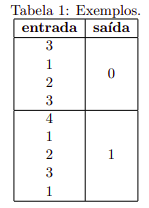
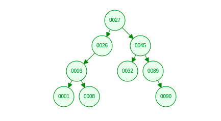
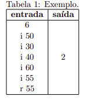
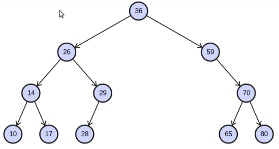
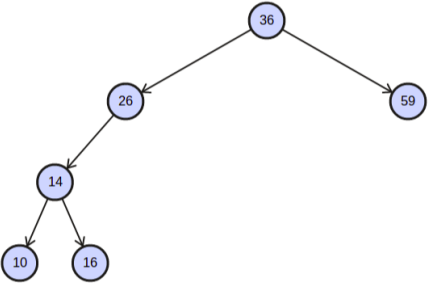
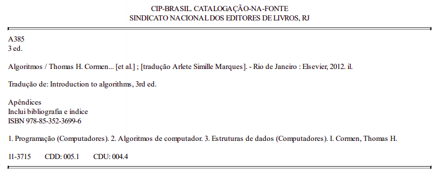
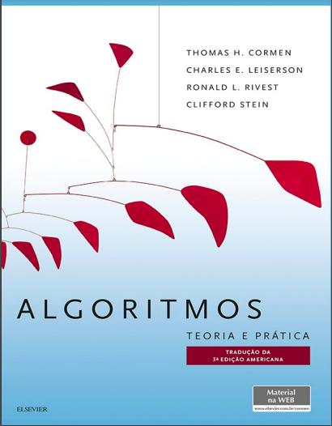

# Exercícios
## **Pilhas em Python**
## 1) Problema 

###    Palíndromo é uma sequência de letras que pode ser lida igualmente de frente para trás ou de trás para frente. Por exemplo, a palavra radar é um palíndromo. Dada uma sequência de letras, a tarefa é escrever um programa em Python que utilize a estrutura de dados Pilha para determinar se a sequência representa ou não um palíndromo. O programa deve ser escrito em Python com estrutura de dados do tipo pilhas e não é permitido usar bibliotecas prontas para esse tipo de estrutura de dados.

### 2) Entrada e Saída de Dados
###   O arquivo de entrada estará no formato texto e terá uma sequência de caracteres. Os espaços em branco devem ser desconsiderados, ou seja, a sequência “o teu dueto” deve ser considerado como um palíndromo. A saída deverá ser sim ou nao.

## **Listas Encadeadas**
## 1) Problema
### Uma lista ligada possui um ciclo se algum nó (valor) é visitado mais do que uma vez enquanto se percorre a lista. Dado um ponteiro para o head de uma lista ligada, escreva um programa em Python para testar se a lista possui um ciclo. Se houver um ciclo, o programa deverá retornar 1. Caso contrário, deverá retornar 0.

## 2) Exemplos
### A lista L1 = 1 → 2 → 3 → null não tem ciclos. Portanto, o programa deverá retornar 0. A lista L2 = 1 → 2 → 3 → 1 → null tem um ciclo, pois o nó 3 tem um valor anterior (1) da lista. Portanto, o programa deverá retornar 1.

## 3) Descrição da Função
### O programa deverá ter, obrigatoriamente, uma função de nome testaCiclo (head) que receberá o ponteiro para o primeiro elemento da lista e retornar o valor 1 (há ciclo) ou 0 (não há ciclo). Não é permitido o uso de arrays e nem o tipo List de Python.

## 4) Entrada e Saída de Dados
### O arquivo de entrada estará no formato texto e terá uma sequência de valores numéricos. A saída deverá ser 1 ou 0. O primeiro valor informa o número de elementos da lista. A Tabela 1 mostra possíveis exemplos de entrada e saída de dados:

## **Árvore AVL**
## 1) Problema
### Árvore AVL é uma árvore binária de busca balanceada. A manutenção do balanceamento da árvore AVL minimiza o número de comparações efetuadas no pior caso para uma busca com chaves de probabilidades de ocorrências. As operações de inserção() e remoção() são responsáveis pelo balanceamento da árvore após a inserção e remoção de elementos, respectivamente. Dado conjunto de elementos (nós) e um conjunto de operações de inserção e remoção, escreva um programa em Python para calcular o nũmero de nõs folha apõs a execução de todas as operações.
## 2) Exemplo
### A Figura 1 apresenta um conjunto de operações de inserção e remoção. Ao final da execução sdessas operações, a árvore terá dois nós folha (30 e 60).

## 3) Entrada e Saída de Dados
### O arquivo de entrada estará no formato texto. A primeira linha informará o número N de elementos (nós). Cada linha de N terá a informação da operação (inserçãoo ou remoção) seguida o valor do elemento. A Tabela 1 mostra possíveis exemplos de entrada e saída de dados:

## Árvore Binária de Busca
## 1) Problema
### Dada uma árvore binária de busca A e um valor v, escreva um programa em Python para localizar o nó folha de A que seja mais próximo de v. Por exemplo, considere a árvore da Figura 1 e o valor de v igual a 22. Neste caso, 17 é o nó folha mais próximo de v.

## 2) Entrada e Saída de Dados
### A entrada de dados será um conjunto de números inteiros, onde o primeiro elemento indica o tamanho da árvore, o segundo elemento representa v e os demais elementos da entrada são os nós de uma árvore binária de busca (ABB). Considere que os elementos serão inseridos na árvore na ordem em que aparecem na entrada. Assim, a entrada do exemplo mencionado inicialmente na Figura 1 seria: 11 22 36 59 26 14 10 29 28 17 70 65 80, onde 11 representa a quantidade de nós da ABB, 22 o valor v e os demais valores são os nós da árvore. Cada valor da entrada aparecerá em uma linha. A saída esperada, neste exemplo, é o valor 17. Eventualmente, poderá ocorrer o caso onde exista mais de um nó com igual distância de v. Neste caso, a saída deverá ser cada nó folha. Por exemplo, considere a árvore da Figura 2 e o valor de v igual a 13. Neste caso, os nós folhas 10 e 16 são equidistantes de v e, portanto, devem ser apresentados como resposta. Os valores apresentados devem, neste caso, devem ser ordenados.

## Resultados na plataforma do [Run codes](https://run.codes/)

# Referências de Estudo
## Livro de Estrutura de Dados

## [Canal no Youtube - Programação Dinâmica](https://youtu.be/zl2c4xfU8ko)
# Obrigado !!!