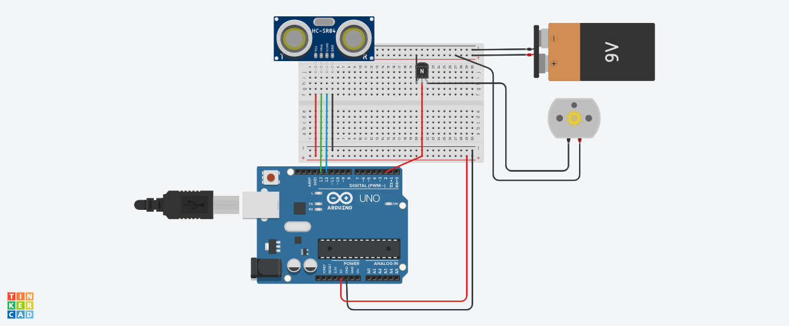

### Digital Innovation One - Programando um robô do zero com Arduíno !

#### Instrutor do lab : [Diego Renan](https://www.linkedin.com/in/diego-renan-bruno-48194484/)

### Minhas melhorias :

### Robô liga a sua arma de ataque quando o inimigo se aproxima, nesta evolução foram utilizados baterias e um transistor para o próprio arduíno controlar esse acionamento

[Linkedin Adevan](https://www.linkedin.com/in/adevan-neves-santos/)

##### O que é Arduino ? 

##### Arduino é uma plataforma de prototipagem eletrônica de hardware livre e de placa única, com suporte de entrada/saída embutido, uma linguagem de programação padrão, a qual tem origem essencialmente em C/C++.

#### Verifique o código disponível do projeto [aqui](./src/projeto-principal.ino)

#### O projeto foi realizado utilizando a plataforma do [AutoDesk Tinkercard](https://www.tinkercad.com/)