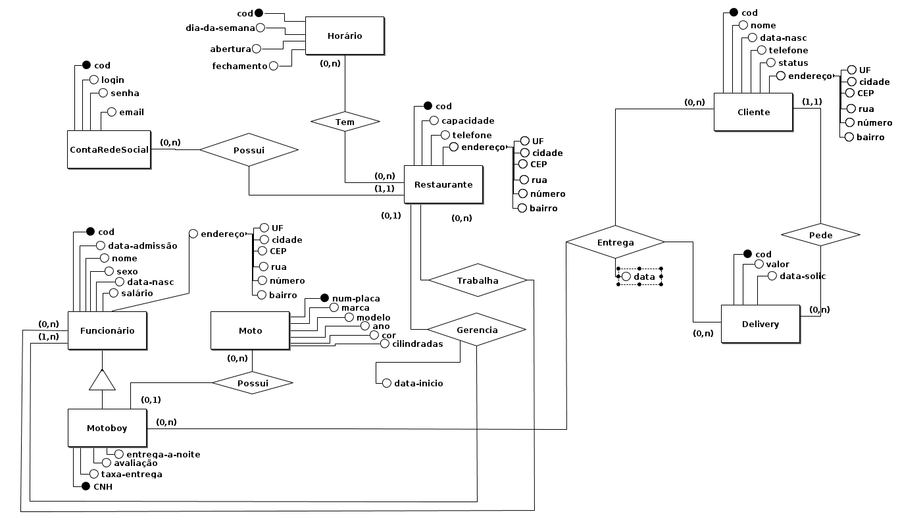
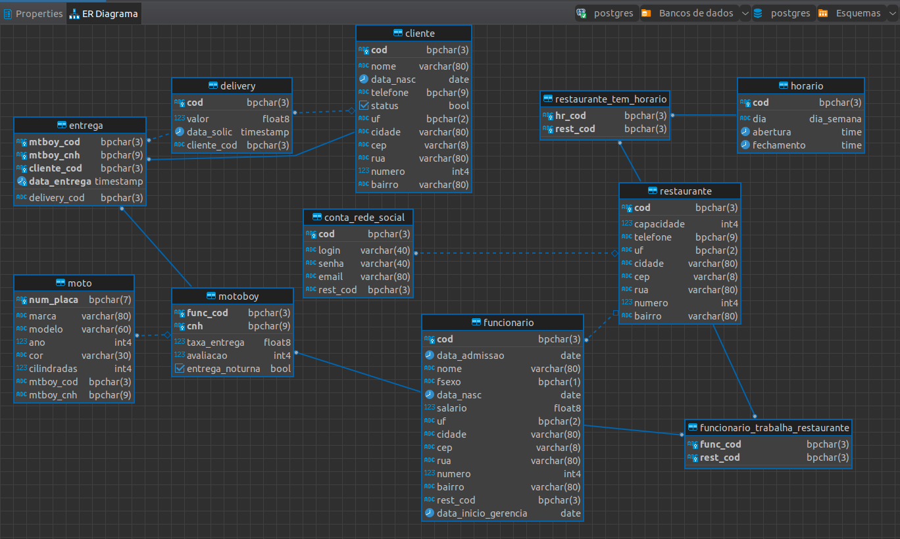
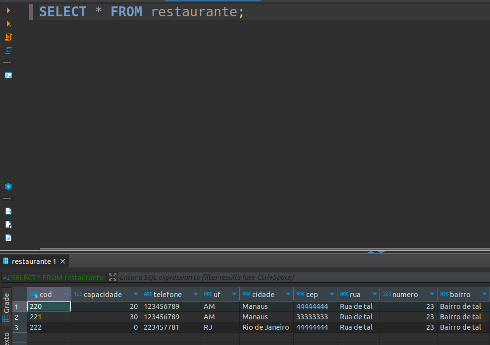

### Disciplina : Banco de Dados

### Sobre : A disciplina de Banco de Dados no curso de Engenharia de Computação apresenta os principais conceitos de bancos de dados, focando nos aspectos de modelagem e manipulação  de dados, capacitando o aluno no uso dos aspectos teóricos e práticos de bancos de dados.

### Autor: [Adevan Neves Santos](https://www.linkedin.com/in/adevan-neves-santos/)

### MEER: Espeto de Cats na ferramenta [BrModelo](https://www.brmodeloweb.com/lang/pt-br/index.html).

### Schema (Diagrama): Espeto de Cats na ferramenta [DBeaver Community](https://dbeaver.io/).

### Tabela Restaurante: Valores dentro do schema no Banco de Dados Postgresql.

- [Mapeamento para relacional](./Atividades/Exercicios/Mapeamento-EER.pdf)

- [SQL-Comandos e exemplos](./SQL/)

- [Diagramas MEER na ferramenta BrModelo](./MEER/)

- [Provas](./Atividades/Provas/)

- [Trabalhos práticos](./Atividades/Trabalhos-Praticos/)

#### "Tudo o que uma pessoa pode imaginar, outras podem tornar real" - Julio Verne.

#### Se você gostou do projeto, não se esqueça de deixar um :star2: !!!!