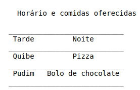

# Bem vindo ao projeto de Restaurante de Adevan Neves Santos

### Abstract Factory é um padrão de design criativo que permite produzir famílias de objetos relacionados sem especificar suas classes concretas

## Como implementar ?

## Implementação dos princípios para a construção de um modelo de restaurante com doces e salgados

### Construção

## 1) Desenvolver a matriz deste projeto de acordo com a regra de negócio escolhida e as variantes no cardápio

- Tabela 1 :man_cook:

  

  

  

## 2) Construir as inferfaces : Doces, Salgados, Restaurante abstrato :pizza: :cake: ..

## 3) Construir duas fábricas concretas e 6 objetos concretos para implementar de acordo com o contexto

## 4) Agora o programa App.java lida apenas com as interfaces e a fábrica abstratra

