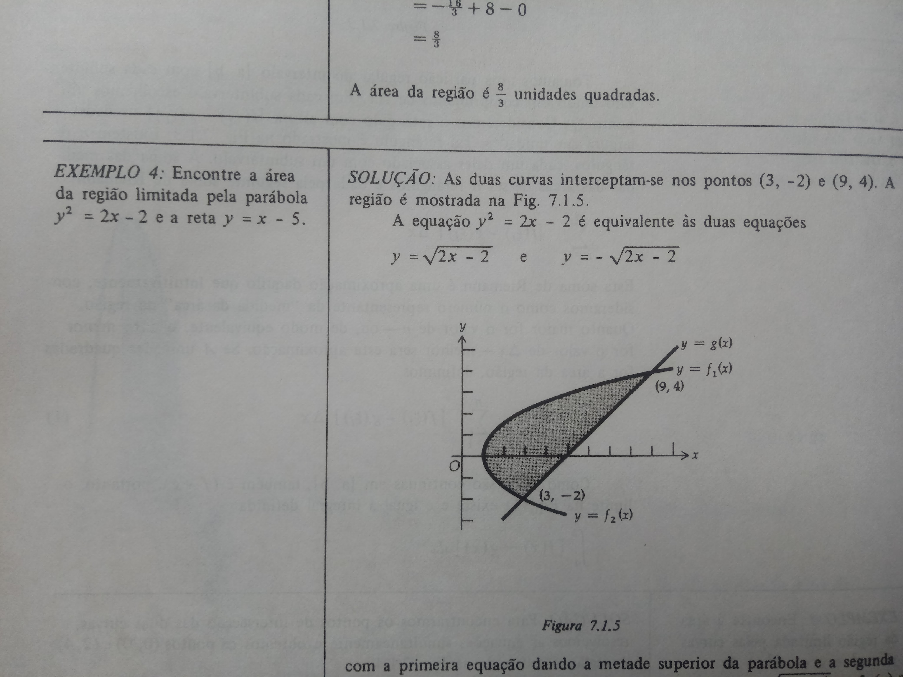
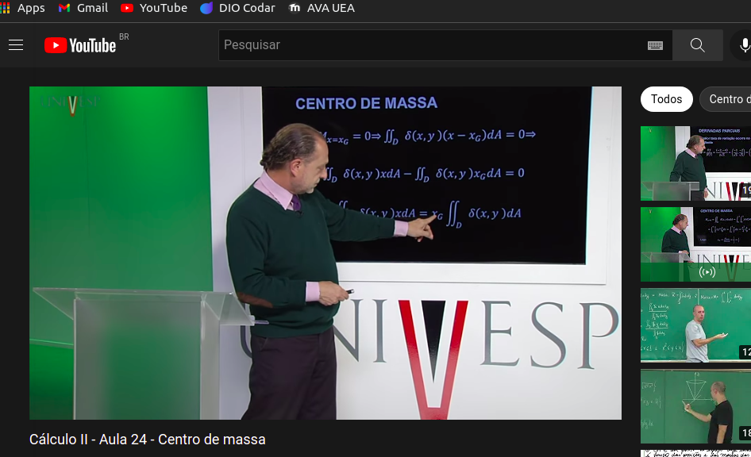

# Seja bem vindo ao Exercício de Matemática Básica do Academia STEM

## Autor : [Adevan Neves Santos](https://www.linkedin.com/in/adevan-neves-santos/)

# Atividade 01 :

### 1) Faça um resumo do que você aprendeu até agora sobre Integrais Definidas e Indefinidas. Neste Resumo podem conter : definições, teoremas, exemplos, esquemas, diagramas entre outros ...

## A inversa da Diferenciação
### ---> Definição : Uma função $F$ é chamada de antiderivada de uma função $f$ em um intervalo I se$F^{,} (x) = f(x)$ para todo valor de x em I, assim como $F(x) + c$ é a antiderivada mais geral, com c sendo uma constante arbitrária
### ---->Exemplo, seja $F(x) = 4x^{3} +x^{2}+ 5$ então $F^{,}(x)= f(x) = 12x^{2}+ 2x$ é uma antiderivada de $f$

## Integral Definida
### ----->Definição : Se $f$ é uma função definida no intervalo fechado [a,b] então a a integral definida de $f$, de a até b, denotada por $\int_{a}^{b} f(x) dx = \sum_{i=1}^{n} f(\xi) \Delta_{i}x$ , se o limite existir.
## Propriedades
### Se $a>b$ então 
$$\int_{a}^{b} f(x)dx= - \int_{b}^{a} f(x) dx$$
###  se $f(a)$ existir 
$$\int_{a}^{a}f(x)dx = 0$$
### Se a função $ f $ é integrável no intervalo fechado [a,b] e se k é uma constante qualquer, então
$$\int_{a}^{b} k f(x) dx = k \int_{a}^{b} f(x) dx$$
### Integral da soma é a soma das integrais
$$\int_{a}^{b} [ f(x)+g(x)] dx = \int_{a}^{b} f(x)dx + \int_{a}^{b} g(x) dx$$
### Se uma função é integrável nos intervalos fechados [a,b] , [a,c] e [c,b],sendo a < c < b 
$$\int_{a}^{b}f(x)dx = \int_{a}^{c}f(x)dx + \int_{c}^{b} f(x)dx$$
## Teorema Fundamental do Cálculo
###  ---->>> Seja $f$ uma função contínua no intervalo fechado [a,b] e $g$ uma função tal que $ g^{,}(x) = f(x) $ para todo x em [a,b] Então :
$$ \int_{a}^{b} f(t)dt = g(b)- g(a) $$

### 2) Faça uma pesquisa (simples) e exponha de forma sucinta algumas aplicações ou situações em que apareça o conceito de integral envolvido na engenharia que você está cursando. (Você tem liberdade pra criar qualquer tipo de material: texto, slide, vídeo, etc)
# Aplicações da Integral Definida
## Área de curva
### ----> O estudo da área em curvas abaixos de funções é de fundamnetal importância em estudos de trabalho na física, na economia e também em matérias mais avançadas de cálculo diferencial. Este número é calculado por meio de resolução da integral formada por todas as funções em suporposição, utilizando as propriedades descritas acima

## Centro de massa em uma barra

### ---> Definição : Uma barra de comprimento L m tem seu extremo esquerdo na origem e o número de quilogramas por metro quadrado na densidade linear em um ponto x m da origem é $ \rho (x) $, onde $ \rho $ é contínua em [0,L]. O momento de massa da barra em relação á Origem é $ M_{0} $ kg-m, onde $ M_{0} $ e o centro de massa da barra está no ponto $\overline{x}$:

$$ \overline{x} = \frac{\int_{0}^{L} x\rho(x)dx }{\int_{0}^{L}\rho (x) dx}  $$
[Veja mais neste vídeo](https://youtu.be/vK5dwicUHDc)

# Obrigado !!!!!!!