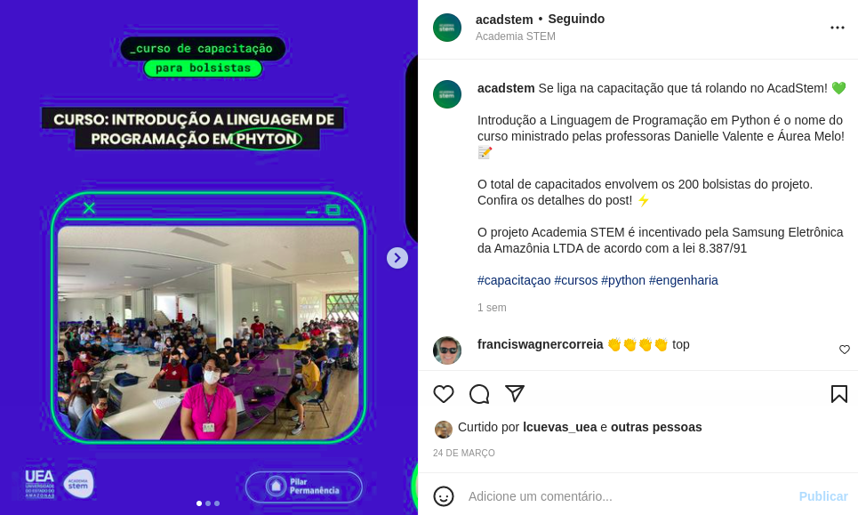
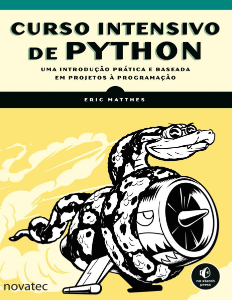

## Seja bem vindo ao curso de Python !!!

## Autor:[Adevan Neves Santos](https://www.linkedin.com/in/adevan-neves-santos/)

## Atividades :
- [1](./Atividade-01.py)
- [2](./avaliacao/ui.py)

## Referências de estudo :

1) Curso Intensivo de Python : Uma introdução prática baseada em projetos

2) [Documentação Oficial da Linguagem Python](https://www.python.org/)

3) [Ferramenta Tkinter para interface gráfica](https://tiforadacaixa.blogspot.com/p/curso-de-tkinter-interface-trafica-para.html)