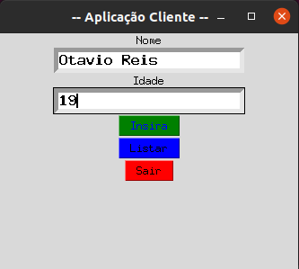
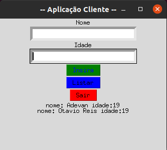
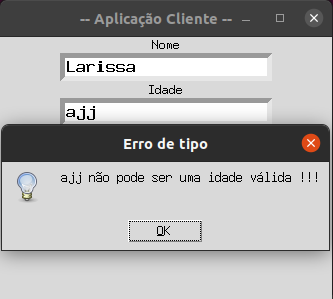

## Exercício de encerramento

1. Criar um sistema modularizado para cadastrar clientes com nome e idade.  O sistema deverá ter 3 funcionalidades no menu: Cadastrar novo cliente, listar clientes cadastrados e sair. O Menu deverá ser apresentado em Interface gráfica. 
2. O sistema deverá ter uma interface gráfica. 
3. O Sistema deverá fazer uso de modularização e manipulação de arquivos.

### Caso consiga todo o sistema poder ser com Interface gráfica, caso contrário só a tela principal (menu)

## Solução :

### Cadastrando o cliente na base de dados (database.json)


### Listando os clientes já cadastrados



### Tratando o caso da idade não ser um inteiro



### Como interagir com o "sistema" ?

```bash
python3 ui.py
```

## Obrigado [Academia STEM](https://stem.uea.edu.br/) !