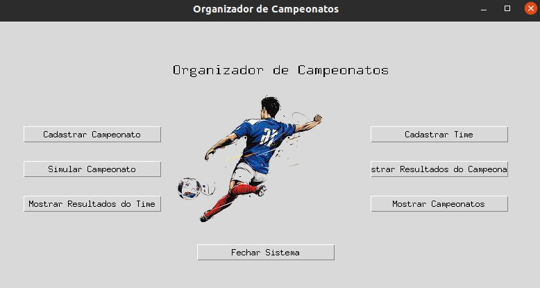
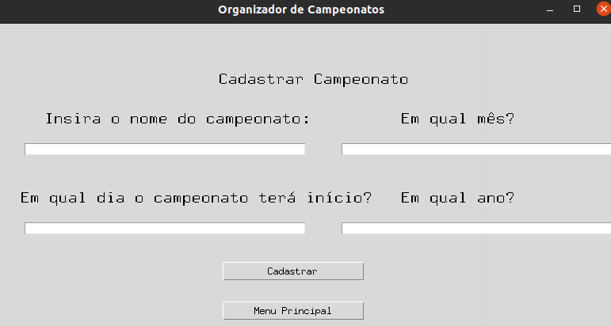

## Seja bem vindo ao Sistema de Gerenciamento de campeonatos de Futebol [Acadstem](https://stem.uea.edu.br/) !!!

### Autores : [Adevan Neves Santos](https://www.linkedin.com/in/adevan-neves-santos/), [Adelmo Máximo](https://www.linkedin.com/in/adelmo-maximo-785010204/), [Gustavo Pacífico](https://www.linkedin.com/in/gustavo-pacifico-0078ba237/) .

### Sobre o projeto : O domínio do sistema é o gerenciamento de diversos campeonatos no modelo pontos corridos. O administrador irá cadastrar os times que serão adicionados na competição. Além disso, será cadastrados os jogadores em seus times e cada time deverá ter um nível de força começando em 1. O estilo de progresso é o de pontos corridos, pois serão simuladas partidas com base no nível de força de cada time ( as estrelas ), sendo na caso de vitória o time ganha +3 pontos, em caso de empate os dois recebem +1 e no caso de o time perder ele não ganhará pontos. Ao final dos combates, o time com maior número de pontos será eleito vencedor do campeonato !

## Ideia Inicial

#### -  Entrada : cadastrar campeonato.

#### -  Processamento: agendar jogos, simular jogos, adicionar time a campeonato, adicionar jogadores a times. 

#### -  Saída : mostrar resultados dos jogos, mostrar times, mostrar jogadores, mostrar campeonatos.

#### Tela Inicial do sistema



#### O organizador de campeonatos administra o cadastro, simulação e organiza todos os campeonatos do modelo de pontos corridos. A sequência correta para utilizar o sistema começa sempre com o cadastro de campeonato. Logo depois você precisará cadastrar no mínimo dois times em cada campeonato que você deseja simular os jogos. Uma vez feita esses cadastros você poderá : acompanhar os resultados do seu time em um campeonato, verificar os resultados de todo campeonato, saber qual foi o vencedor em um determinado campeonado e saber os nomes de campeonatos disponíveis para participar. 



#### Utilizamos arquivos json para armazenamento de dados

```json
{
    "flamengo": {
        "estrelas": 5,
        "pontos": 0,
        "n_jogadores": 25,
        "gols_marcados": 0
        }
    }
```

#### Como interagir com a aplicação ?

#### Você deve rodar o seguinte código em seu interpretador de comandos favorito (bash, power shell etc.)

```bash
python Interface.py
```